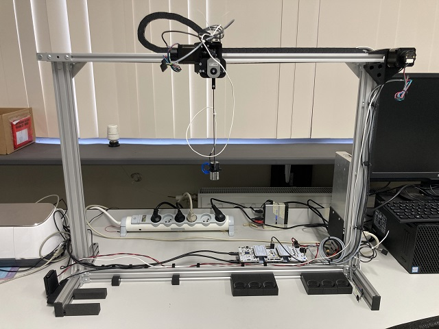
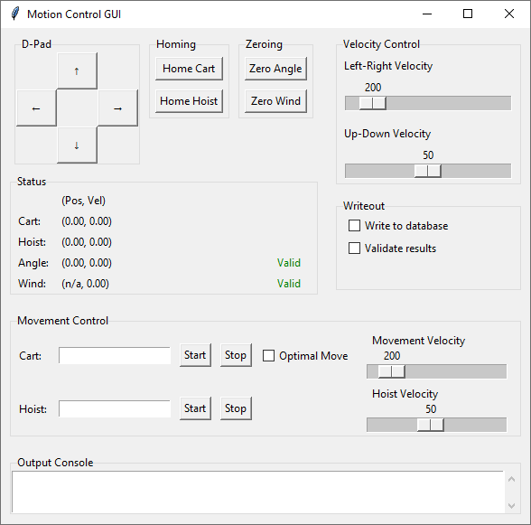

# Lab-scale Gantry Crane Digital Twin Exemplar

This repository describes a lab-scale gantry crane digital twin exemplar. This exemplar was used in a couple of our [publications](#publications). This readme only contains basic information, for the complete documentation, head to [github pages](https://Cosys-Lab.github.io/lab-scale-gantry-crane/).

The repository is structured as follows:

- [BOM](BOM/): the Bill-of-Materials of the crane.
- [C4-diagrams](C4-diagrams/): C4 diagrams of the crane's software used in the EDTConf submitted exemplar paper.
- [CAD](CAD/): CAD models of the crane in Fusion360, as well as 3MF exports for 3D printing.
- [arcadia](arcadia/): Capella models of the crane used in the SpaceRaise doctoral school.
- [arduino](arduino/): KiCad project of an optional Arduino shield that simplifies connecting the sensors of the crane, and accompanying code.
- [docker](docker/): A Docker compose file and associated files allowing for easy setup of the necessary background services.
- [docs](docs/): docs for creating the GitHub pages with MkDocs
- [examples](examples/): Examples of the Python module that controls the crane.
- [gantrylib](gantrylib/): The Python module controlling and monitoring the crane.
- [tests](tests/): Tests of the gantrylib module.

## Hardware Quickstart

Refer to the [build guide](https://cosys-lab.github.io/lab-scale-gantry-crane/build/) on GitHub Pages.

## Software Setup

### Python

Install Python. On Windows, preferably use Python 3.13 or higher, since earlier versions have a low resolution (only 15.6 ms) of the `time()` and `datetime.now()` functions, which are used often in the code.

Install the `gantrylib` module locally as editable installation. From the root of the repository folder, run:

    python -m pip install -e .

### Background services

The software relies on a TimescaleDB database, a Grafana dashboard and, optinally an MQTT broker. The setup files of all of these are contained in the [docker](docker/) folder. Assuming docker and docker compose are installed, from the docker folder, it suffices to run:

    docker compose up

The containers can then be started and stopped with:

    docker compose stop
    docker compose start

To remove the containers and the network connecting them, run:

    docker compose down

The config is exceptionally insecure, since all of the default usernames/passwords are used. If this is a problem, do change them.

#### TimeScaleDB
- address: localhost
- port: 5432
- user: postgres
- password: postgres
- database: gantrycrane

#### Grafana Dashboard
- address: localhost
- port: 3000
- user: admin
- password: admin (On first login via http://localhost:3000, you will be prompted to change the password. Nothing blocks you from reusing the old password though.)

#### MQTT
- address: localhost
- port: 1883
- user: not necessary, anonymous connections are allowed

## Software quickstart

Assuming you went through the [software setup](#software-setup) and built the crane according to the [hardware quickstart](#hardware-quickstart), the fastest way to get the crane to do something is using the [run_with_hmi.py](examples/run_with_hmi.py) example.

You will have to configure [crane-properties.yaml](examples/crane-properties.yaml) for your specific installation, more specifically, specify the serial ports of the two motor controller boards. Unfortunately, the Trinamic devkits don't offer a unique ID that allows you to identify them, therefore we recommend plugging in the boards one by one, and noting down the serial ports that appear as you plug them in (in `device manager/Ports (COM & LPT)` in Windows, or under `/dev/tty*` in Linux.)

Once you have noted down those ports, update the following two fields in the config:

    cart_motor_port: COM13
    ...
    hoist_motor_port: COM8

You can now run the example.

Upon first starting, it will home the cart and hoist motor. Homing the cart motor happens automatically, homing the hoist motor must be done with some manual user input. The script prompts you to confirm this on the command line. Afterwards you will see the simple HMI interface that allows you to move the crane.

## Publications

Below are publications in which this exemplar was used:

1. J. Mertens and J. Denil, *Localizing Faults in Digital Twin Models by Using Time Series Classification Techniques*, 2024 Winter Simulation Conference (WSC), IEEE, Dec. 2024, pp. 2868–2879. [https://doi.org/10.1109/wsc63780.2024.10838825](https://doi.org/10.1109/wsc63780.2024.10838825)

2. J. Mertens, S. Klikovits, F. Bordeleau, J. Denil, and Ø. Haugen, *Continuous Evolution of Digital Twins using the DarTwin Notation*, Software and Systems Modeling, p. 22, Nov. 2024. [https://doi.org/10.1007/s10270-024-01216-7](https://doi.org/10.1007/s10270-024-01216-7)

3. J. Mertens and J. Denil, *Reusing model validation methods for the continuous validation of digital twins of cyber-physical systems*, Software and Systems Modeling, p. 23, Oct. 2024. [https://doi.org/10.1007/s10270-024-01225-6](https://doi.org/10.1007/s10270-024-01225-6)

4. J. Mertens and J. Denil, *Digital-twin Co-evolution using Continuous Validation*, In Proceedings of the ACM/IEEE 14th International Conference on Cyber-Physical Systems (with CPS-IoT Week 2023), ICCPS ’23, San Antonio, TX, USA: ACM, 2023, pp. 266–267. [https://doi.org/10.1145/3576841.3589628](https://doi.org/10.1145/3576841.3589628)

