# build.md

## Building instructions.

TODO: complete this further.

For now: refer to the Fusion360 files.

## Screws

The following images try to convey which bolts and nuts are needed at which spots in the crane.
I will edit these in the future to have annotation on them.

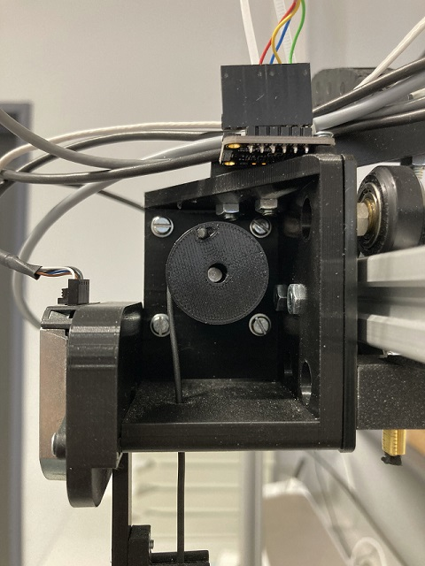

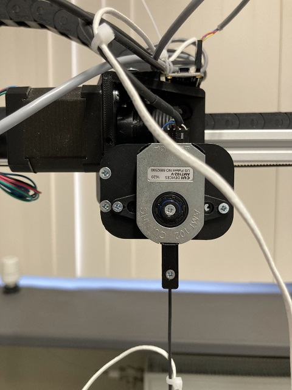

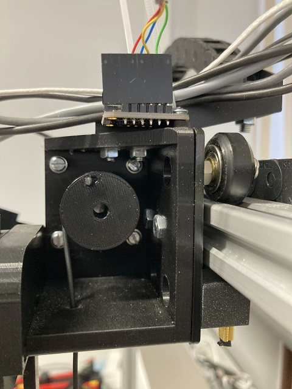

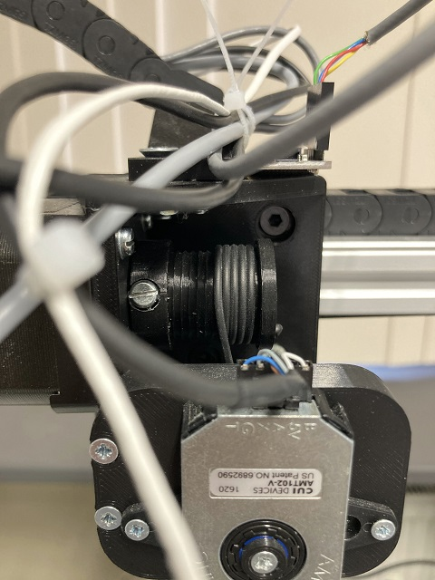

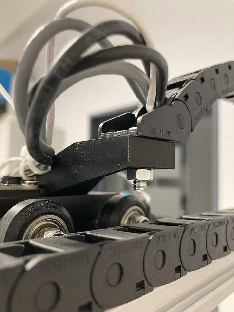

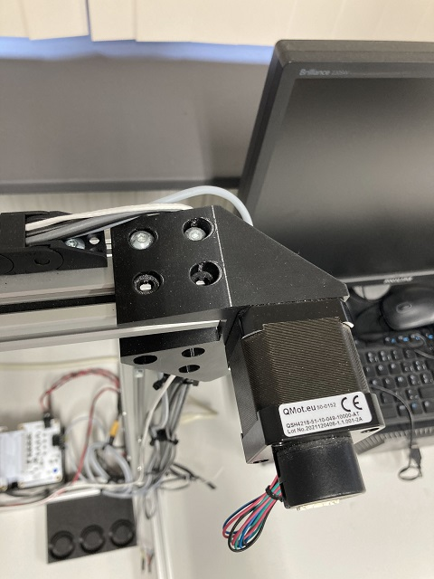

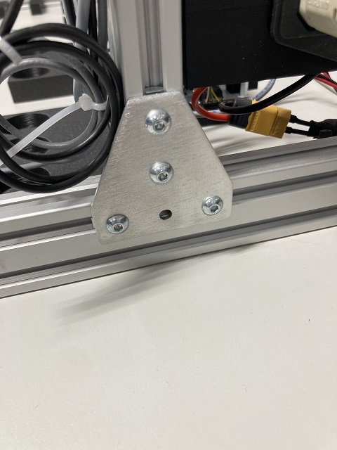

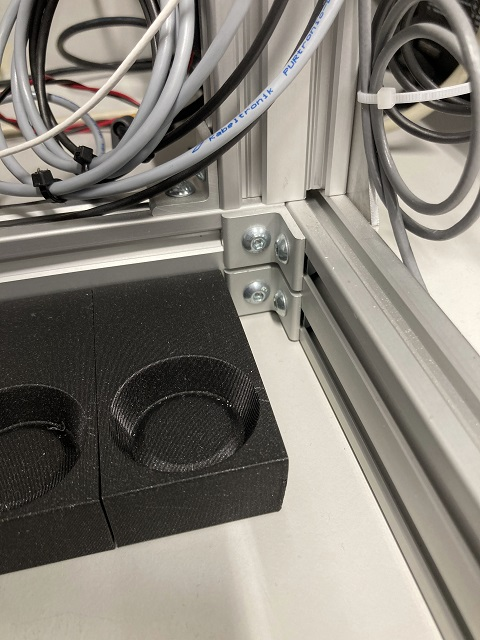

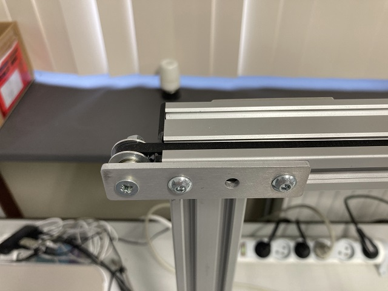

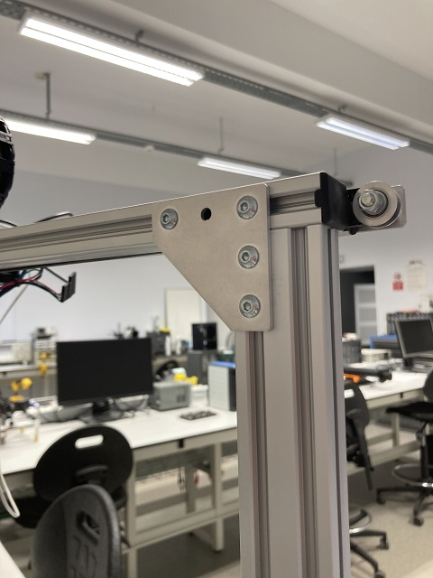

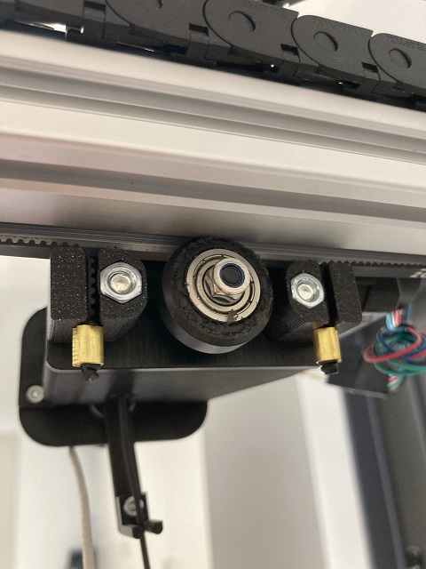