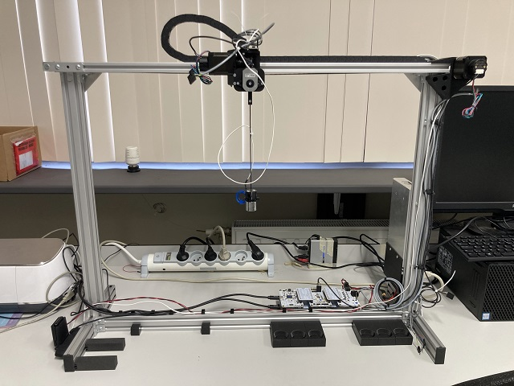

# Lab Scale Gantry Crane Docs

{: .small-img align=right}

This is the documentation of the lab scale gantry crane. It is a little gantry crane that has been used in various papers as a demonstrator. The documentation covers the build of the crane, the accompanying `gantrylib` module and exmaples using this module.

## Documentation layout

* Home: this page
* Build: building instructions for the physical part of the crane.
* Arduino: documentation of the arduino scripts
* Examples: documentation of the examples
* gantrylib: api reference for the `gantrylib`

## Software prerequisites

### Installing gantrylib

The examples rely on the `gantrylib` module. Since there's no official release we recommend installing it in editable mode, this also allows for on the fly code changes. In the root of this repository run:

    python -m pip install -e .

We recommend doing so in a virtual environment.

### Arduino sketches

To open and flash the Arduino sketches you can install the [Arduino IDE](https://www.arduino.cc/)

### Opening CAD files

All CAD files are made with [Fusion360](https://www.autodesk.com/products/fusion-360/free-trial)
It's free for personal use. Your educational institution likely also has a license.

All files have already been exported to 3MF files, so you only need Fusion360 when you want to make edits.

### Viewing the docs offline

The docs are built with `MkDocs`. If you want to host those locally rather than view them on GitHub pages you should additionally install it.

    python -m pip install mkdocs mkdocstrings[python]

You can view the docs by running 

    mkdocs serve

Then opening http://127.0.0.1:8000/

## Hardware prerequisites

### 3D Printer

Some parts of the crane need to be 3D printed. To do so you need a 3D printer and accompanying slicer.

For reference: our parts where printed on Prusa i3 MK4's and sliced with [PrusaSlicer](https://www.prusa3d.com/page/prusaslicer_424/)